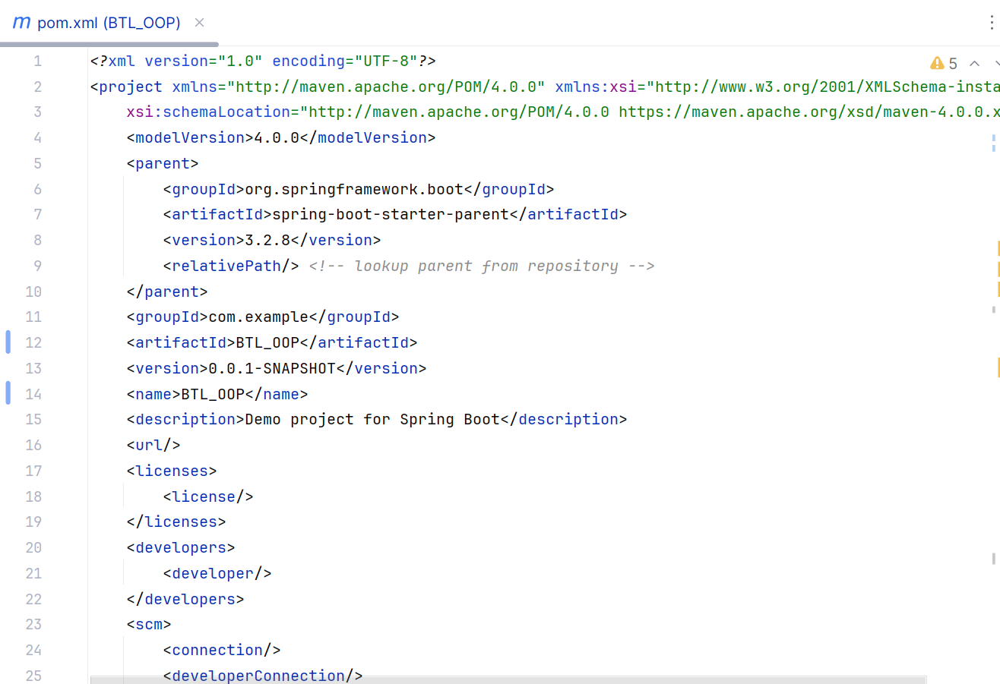
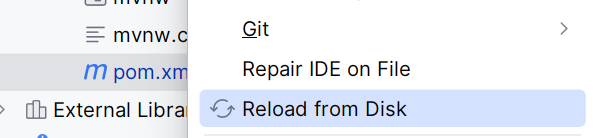

# Cách chạy project
## 1. Clone code
### git clone https://github.com/Jaycelation/BE.git
## 2. Set up db (Mysql) 
### Tạo database 
### Sửa file application.yml và application-local.yml sao cho phù hợp
    url: ${MYSQL_URL:jdbc:mysql://localhost:{số port database}/{tên database}}
    username: ${MYSQL_USERNAME:root}
    password: ${MYSQL_PASSWORD:{password database}}
## 3. Load file cấu hình
### Mở project trong IDE (netbean, ij ...)
### Tìm file pom.xml
### 
### Click chuột phải chọn reload from disk
### 
## 4. Chạy dự án
### Sau khi đã load file cấu hình, có thể bấm shift+F10 hoặc click vào biểu tượng run
### 
